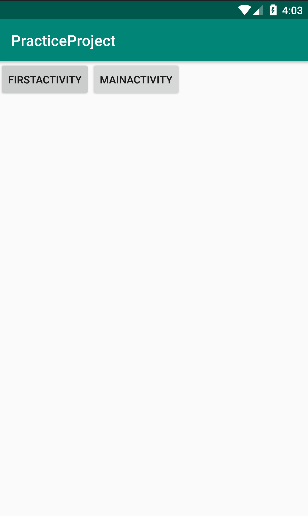

# Android 四大组件 —— Activity

Actvity是Android中的四大组件之一，平常我们在手机一个用程序上所看的界面就是 Activity 的表现形式。而且 Activity 也是用户唯一能够感知到的组件，每一个UI的界面就是通过 Activity 显示在屏幕上的，平常我们在软件里进行的各种页面的切换很大一部分是不同 Activity 的跳转。

## 一、创建一个 Activity
#### 1. 创建一个 Activity 的子类
创建一个继承自 Activity 的类，即可创建一个 Activity。

```java
public class MainActivity extends Activity {
    @Override
    protected void onCreate(Bundle savedInstanceState) {
        super.onCreate(savedInstanceState);
        setContentView(R.layout.activity_main);
    }
}
```


#### 2. 创建布局文件
Activity 是一个展示型的而组件，我们在 app 中看到的界面在代码里面基本上是一个个的 Activity。在 onCreate 方法中会调用 setContentView() 方法加载一个xml类型的视图文件，这个文件里面定义了我们在界面上看到的内容，比如搜索框，列表等等。上面的代码就是加载了一个 activity_main.xml 文件，代码如下：

```xml
<?xml version="1.0" encoding="utf-8"?>
<LinearLayout xmlns:android="http://schemas.android.com/apk/res/android"
    xmlns:tools="http://schemas.android.com/tools"
    android:layout_width="match_parent"
    android:layout_height="match_parent"
    tools:context=".MainActivity">

    <Button
        android:id="@+id/first_activity"
        android:layout_width="wrap_content"
        android:layout_height="wrap_content"
        android:text="FirstActivity"
        android:onClick="onClick" />

    <Button
        android:id="@+id/button2"
        android:layout_width="wrap_content"
        android:layout_height="wrap_content"
        android:text="Button" />

</LinearLayout>
```

`<Button>` 标签用于定义一个按钮，上面的代码中定义了两个按钮。

#### 3. 在清单文件中声明 Activity
在 AndroidManifest.xml 中声明一个 `<activity>` 标签来声明一个 Activity。这是应用的清单文件，系统根据这个文件来配置应用的组件信息。
```xml
<?xml version="1.0" encoding="utf-8"?>
<manifest xmlns:android="http://schemas.android.com/apk/res/android"
    package="com.zero.practiceproject">

    <application
        android:allowBackup="true"
        android:icon="@mipmap/ic_launcher"
        android:label="@string/app_name"
        android:roundIcon="@mipmap/ic_launcher_round"
        android:supportsRtl="true"
        android:theme="@style/AppTheme">

        <activity android:name=".MainActivity">
            <intent-filter>
                <action android:name="android.intent.action.MAIN" />

                <category android:name="android.intent.category.LAUNCHER" />
            </intent-filter>
        </activity>
    </application>

</manifest>
```
- Android:name：这个属性告诉应用声明的是哪个 Activity，其值为 Activity 的完整类名。

#### 4. 运行
运行得到如下的结果：


## 二、Activity 生命周期

上面的 MainActivity.java 中，有一个 onCreate 方法，这其实是 Activity 组件的生命周期回调方法，除了 onCreate 之外，还有其他 6 个回调方法，分别对应 Activity 不同的状态，如下：

|||
|--|--|
|**onCreate**|此方法在活动创建时被触发，此时活动处于创建状态，一般 Activity 的一些初始化的工作在该方法中执行，且在生命周期内只会执行一次。在该方法调用 setContentView 中进行 View 的创建。|
|**onStart**|这个方法紧接着 onCreate ，此时已经是可以看到活动的了，但是无法进行交互。此时 Activity 处于启动的状态。紧接着会回调 onResume() 。|
|**onResume**|此时 Activity 处于 Resume 状态，位于前台完全可见也可以进行交互，我们看到的界面便是 Activity 保持在 onResume() 状态。该方法之后是 onPause() 方法。|
|**onPause**|该方法是在 onResume 之后执行的，此时活动处于暂停状态，不在位于前台，可见但是无法交互。这个方法的执行时间非常短，因此不应该在此方法中执行重量级的资源释放。|
|**onStop()**|此时活动对用户已经不可见了。紧接着会回调 onRestart() 或者 onDestory()。此时 Activity 处于停止状态，Activity 的实例还是存在的，只是没有被显示。此方法中可以释放对用户不可见时的资源。也可以在此方法中进行数据的保存。|
|**onRestart()**|表示 Activity 从停止状态重新启动。后面会回调 onStart()|
|**onDestroy()**|活动被销毁，这是系统生命周期的最后一个回调。一般在这个回调中进行释放所有还未释放的资源。|

官方有给出 Activity 的生命周期图，如下：

     


 Acticity 的生命周期会有以下几种异常的情况

- **系统配置发生改变**

比如屏幕的方向发生旋转、该改变语言环境，或者输入设备发生更改。当这些发生时， Activity 会被销毁和重建， Activity 会执行`onPause -> onStop -> onDestory -> onCreate -> onStart -> onResume`。可以在清单文件中为 Acticity 设置 `android:configChanges ` 属性来指定 Activity 在哪些配置改变的情况下不销毁。可选值如下，不同的值用 ' | ' 连接起来，该属性所有的可取值如下

| 值     | 含义                                                         |
| ------- | ------------------------------------------------------------ |
| mcc | SIM卡唯一标识IMSI（国际移动用户识别码）中的代码，有三位数组成，中国为460，此项标识mcc代码发生了改变 |
| mnc | SIM卡唯一标识了IMSI（国际移动用户识别码）中的运营商代码，由两位数组成，中国移动TD系统为00，中国联通为01，中国电信为03，此项标识mnc发生了改变 |
| locale | 设备本地位置发生了改变，一般指切换了系统语言 |
| touchscreen | 触摸屏发生了改变，这个很费解，正常情况下无法发生，可以忽略它 |
| keyboard | 键盘类型发生了改变，比如用户使用了外插键盘 |
|keyboardHidden|键盘的可问性发生了改变，比如用户调出了键盘|
|navigation|系统导航方式发生了改变，比如采用了轨迹球导航，这个很难发生，可以忽略它|
|screenLayout|屏幕布局发生了改变，很可能是用户激活了另一个显示设备|
|fontStyle|系统的字体缩放比例发生了改变，比如用于选择了一个新的字号|
|uiMode|用户界面模式发生了改变，比如是否开启了夜间模式（API 8添加）|
|orientation|屏幕方向发生了改变，这个是最常用的，比如旋转了手机屏幕|
|screenSize|当屏幕的尺寸信息发生了改变，当旋转设备屏幕时，屏幕尺寸会发生变化，这个选项比较特殊，它和编译选项有关，当编译选项中的minSdkVersion和targetSdkVersion均低于13时，此选项不会导致Activity重启，否则会导致Activity重启（API 13重新添加）|
|smallestScreenSize|设备的物理尺寸发生了改变，这个项目和屏幕的方向没有关系，仅仅在实际的物理屏幕尺寸改变时的时候发生，比如用户切换到了外部的显示设备，这个选项和screenSize一样，这个选项不会导致Activity重启否则会导致Activity重启|
|layoutDirection|当布局发现发生变化，这个属性用的比较少，正常情况下无需修改布局的layoutDirection属性（API 17时添加）|

我们常用的只有 locale 、orientation 和 keyboardHidden 这三个选项。当系统配置发生改变时，系统会回调onConfigurationChanged方法。另外，Android 3.2 之后，当设备的方向发生改变时，同时也会触发屏幕的尺寸信息改变，因此 “orientation” 要与 “screenSize” 一起使用才会生效


- **系统内存不足。**

系统内存不足时会杀死优先级较低的进程，来为系统腾出空间，该进程所包含的组件（比如 Activity）则会被销毁。

关于系统进程的优先级，Android 根据进程中运行的组件以及其所处的状态对进程做了一个优先级的划分（从高到低）：
* **前台进程**：用户当前正在使用的进程。一个前台进程需要具备以下条件的任意一个或者几个：
    * 有一个显示在当前用户屏幕的最上面的 Activity ，并且正在与用户进行交互（此时 onResume 已经被调用了）
    * 进程中的有一个广播接收器正在执行 onReceive 方法。
    * 进程中有一个服务正在执行它的某一个回调（ onCreate，  onStart() 或者 onDestory()）
* **可见进程**：正在执行用户感知得到的任务。它需要具备以下条件的一个或几个：
    * 该进程中运行的一个 Activity 对用户可见但不处于交互状态。例如 Activity 被部分覆盖的情况
    * 该进程中有一个运行在前台的服务（正在执行 Service.startForeground() 方法。）
    * 承载一个用于执行特定功能的系统服务，比如动态壁纸，输入法等等，这些服务是能够被用户感知的。
* **服务进程**：该进程包含一个已启动的后台服务，这些服务一般在后台执行一些用户所关心的任务（比如网络数据的上传和下载）。在 Android 会对运行时间过长的服务进行降级以避免服务长时间运行而导致内存泄漏或者内存被大量占用。
* **缓存进程**：该进程在系统中是可有可无的，因此在系统需要内存的时候会杀死。这些进程一般包含大量对用户不可见的 Activity 。系统有一个列表用于保存这些缓存进程，该列表中的最后一个进程是最先被系统回收的进程。

> 注：进程之间的依赖性对进程的优先级也会有影响。比如进程 A 绑定到带有 Context.bind_auto_create标志的服务，那么该服务所在的进程的优先级至少是和 A 进程的优先级一样。

## 三、Activity 的启动模式
Activity 有四种启动模式，分别是 standard 模式，singleTop 模式，singleTask 模式，singleInstance 模式。

可以使用 `android:launchMode` 这个属性指定 Activity 的启动模式

#### 1. standard 模式
这种模式下，每次打开 Activity ，不管该 Activity 先前是否存在，都会在启动它的 context 所在的任务栈中创建一个新的实例，如果 context（比如 ApplicationContext） 没有任务栈的话，则会抛异常。

Activity 的默认启动模式就是 standard。

示例：
创建两个 Activity，分别命名为 MainActivity 和 FirstActivity，代码如下
```java 
public class MainActivity extends Activity {
    @Override
    protected void onCreate(Bundle savedInstanceState) {
        super.onCreate(savedInstanceState);
        setContentView(R.layout.activity_main);

        firstActivty = findViewById(R.id.first_activity);
    }

    public void onClick(View view){
        Intent intent ;
        switch (view.getId()){
            case R.id.first_activity:
                intent = new Intent(MainActivity.this, FirstActivity.class);
                startActivity(intent);
                break;
            case R.id.main_activity:
                intent = new Intent(MainActivity.this, MainActivity.class);
                startActivity(intent);
                break;
            default:
                break;
        }
    }
}
```

```java
public class FirstActivity extends Activity {
    @Override
    protected void onCreate(Bundle savedInstanceState) {
        super.onCreate(savedInstanceState);
        Log.d(TAG, "onCreate()");
        setContentView(R.layout.activity_first);
    }

    public void onClick(View view){
        Intent intent;
        switch (view.getId()){
            case R.id.first_activity:
                intent = new Intent(FirstActivity.this, FirstActivity.class);
                startActivity(intent);
                break;
            case R.id.main_activity:
                intent = new Intent(FirstActivity.this, MainActivity.class);
                startActivity(intent);
                break;
            default:
                break;
        }
    }
}
```
这两个 Activity 的布局文件内容是一样的，都有两个按钮，当按钮被点击时会回调上面的 onClick 方法，一个会跳转 FirstActivity，一个会跳转 MainActivity 。运行结果如下：



这是第一次打开时的界面，点击一下第一个按钮跳转到 FirstActivity，点击第二个按钮跳转到 MainActivity，总共执行三次，然后在命令提示符界面输入下面的命令查看任务栈：
```shell
adb shell dumpsys activity activities
```
执行结果如下：
```
ACTIVITY MANAGER ACTIVITIES (dumpsys activity activities)
Display #0 (activities from top to bottom):
  Stack #1:
  ....
    * TaskRecord{2e84c21 #12 A=com.zero.practiceproject U=0 StackId=1 sz=7}
      ...
      * Hist #6: ActivityRecord{9d60aed u0 com.zero.practiceproject/.MainActivity t12}
          ....
      * Hist #5: ActivityRecord{a9ad91f u0 com.zero.practiceproject/.FirstActivity t12}
          ....
      * Hist #4: ActivityRecord{f891941 u0 com.zero.practiceproject/.MainActivity t12}
          ....
      * Hist #3: ActivityRecord{c813fd3 u0 com.zero.practiceproject/.FirstActivity t12}
          ....
      * Hist #2: ActivityRecord{bdefd55 u0 com.zero.practiceproject/.MainActivity t12}
          ....
      * Hist #1: ActivityRecord{7f05e47 u0 com.zero.practiceproject/.FirstActivity t12}
          .....
      * Hist #0: ActivityRecord{aa5745a u0 com.zero.practiceproject/.MainActivity t12}
          .....

    Running activities (most recent first):
      TaskRecord{2e84c21 #12 A=com.zero.practiceproject U=0 StackId=1 sz=7}
        Run #6: ActivityRecord{9d60aed u0 com.zero.practiceproject/.MainActivity t12}
        Run #5: ActivityRecord{a9ad91f u0 com.zero.practiceproject/.FirstActivity t12}
        Run #4: ActivityRecord{f891941 u0 com.zero.practiceproject/.MainActivity t12}
        Run #3: ActivityRecord{c813fd3 u0 com.zero.practiceproject/.FirstActivity t12}
        Run #2: ActivityRecord{bdefd55 u0 com.zero.practiceproject/.MainActivity t12}
        Run #1: ActivityRecord{7f05e47 u0 com.zero.practiceproject/.FirstActivity t12}
        Run #0: ActivityRecord{aa5745a u0 com.zero.practiceproject/.MainActivity t12}

    mResumedActivity: ActivityRecord{9d60aed u0 com.zero.practiceproject/.MainActivity t12}
    mLastPausedActivity: ActivityRecord{a9ad91f u0 com.zero.practiceproject/.FirstActivity t12}
.....
```
可以看到当前应用所属的任务栈为 Stack#1，id 为 1。里面有 7 个 Activity 实例。第一次进界面时本身就会有一个 MainActivity 实例。

#### 2. singleTop 模式
栈顶复用模式。这种模式下，如果启动的 Activity 位于任务栈的栈顶，则会直接复用该实例。否则创建一个新的实例压入栈中。


通过下面的代码设置该模式：
```xml
<activity
    ....
    andorid:launchMode="singleTop"/>
```

#### 3. singleTask 模式
栈内复用模式。这种模式下，会直接复用任务栈中已经存在的 Activity 实例，重新回到这个 Activity 时，它的 onNewIntent() 方法会被调用，接着调用 onStart() 和 onResume() 。

如果找不到，在重新创建一个新的实例。

通过下面的代码设置该模式：
```xml
<activity
    ....
    andorid:launchMode="singleTask"/>
```

可以通过在 `<activity>` 标签中设置 `android:taskAffinity` 属性来指定 Activity 所属的任务栈。修改一下 AndroidManifest.xml，将 FirstActivity 的启动模式设置为 “singleTask”，并为其指定 taskAffinity 属性，如下：
```xml
<activity android:name=".FirstActivity"
            android:launchMode="singleTask"
            android:taskAffinity=":firstActivity">
</activity>
```
其他代码不变，运行之后，点击第一个按钮，然后点击第二个按钮。操作两轮。然后看一下任务栈信息，精简后如下：
```
ACTIVITY MANAGER ACTIVITIES (dumpsys activity activities)
Display #0 (activities from top to bottom):
  Stack #1:
  ...
    * TaskRecord{baaaf3 #14 A=com.zero.practiceproject:firstActivity U=0 StackId=1 sz=2}
        ....
      * Hist #1: ActivityRecord{56e2909 u0 com.zero.practiceproject/.MainActivity t14}
          ...
      * Hist #0: ActivityRecord{57decdd u0 com.zero.practiceproject/.FirstActivity t14}
        ...
    * TaskRecord{f086229 #13 A=com.zero.practiceproject U=0 StackId=1 sz=1}
     
      * Hist #0: ActivityRecord{542c5ec u0 com.zero.practiceproject/.MainActivity t13}
    ....
```
可以看出，现在这个应用中有两个任务栈，一个为 com.zero.practiceproject:firstActivity，这就是为 FirstActivity 指定的任务栈。另一个是 com.zero.practiceproject，这是应用默认的任务栈。

第一次进入应用的时候，有一个应用默认的任务栈，里面有一个 MainActivity，

- **第一轮操作**

点击第一个按钮跳转到 FirstActivity 之后，便新建了一个 `com.zero.practiceproject:firstActivity` 任务栈，并创建一个 FirstActivity 实例放入其中，接着在 FirstActivity 界面点击按钮跳转到 MainActivity，此时会创建一个新的 MainActivity 实例，压入 `:firstActivity` 栈中，如下图

<center>


</center>

- **第二轮操作**

现在界面上显示的是 MainActivity，点击按钮跳转 FirstActivity，由于它的栈内复用特性，不会创建新的实例，但是要把它调到前台来，它之上的 MainActivity 就会出栈，栈内的实例如下：

<center>


</center>

再次跳转到 MainActivity 时，又会重新创建 MainActivity 的实例，此时栈内的实例又会边上第一轮操作的那样。也因此上面打印出的栈的信息中，`com.zero.practiceproject:firstActivity` 这个任务栈中只会有两个实例。


#### 4. singleInstance 模式
单例模式。这种模式下的 Activity 单独的位于一个任务栈中，每次启动 Activity 时，会先去寻找系统中是否存在实例，如果存在则将 Activity 所在的任务栈调到前台来，这种 Activity 具有全局唯一性。

配置方式：
```xml
<activity
    ....
    andorid:launchMode="singleInstance"/>
```


## 四、总结
Android 有四大组件，唯一能够被用户感知的组件就是 Activity。

创建一个 Activity 很简单，只需继承系统的 Activity 或者 AppCompatActivity 类即可创建。

Activity 有它的生命周期，每个生命周期的状态都有其对应的回调方法。

## 参考文档

- 《Android 开发艺术探索》第一章

- [Android Developer Activity](https://developer.android.com/guide/components/activities)


<div align=center></div>