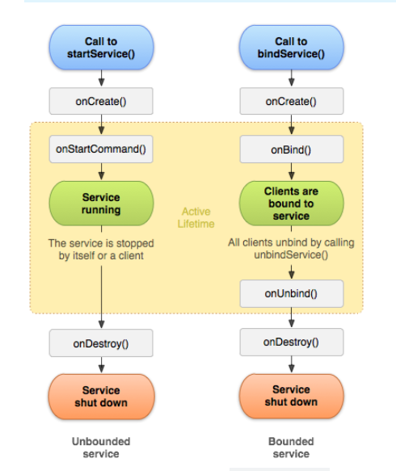
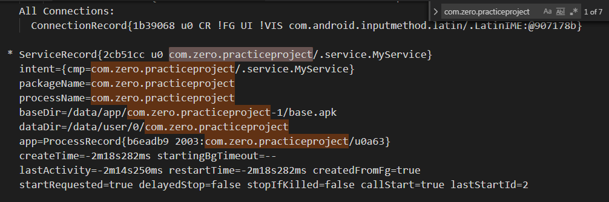

### 一、Service 概述
关于 Service 的介绍，官方文档里面有给详细的说明，它是一个可以再用户看不到的情况下长时间执行某项任务的应用组件。它可以由 Activity 通过调用 `startService()` 方法来启动，也可以跟 Activity 进行绑定，Activity 也可以通过绑定到 Service 来与其进行交互。

#### 1. Service 状态 

一般情况下，Service 会有两种状态：
* **启动状态**：Activity 调用 startService 启动服务之后， Service 便位于这个状态。这种状态下，服务会在后台无限期的运行，知道服务的任务执行完毕，一般我们启动服务用于执行某项任务，任务执行完了之后便会退出，且不会返回结果。
* **绑定状态**：应用组件调用了bindService之后，服务就会处于该状态，此时服务会提供一个客户端的示例，通过该示例可以与Service进行交互，一般用于跨进程通信。一个服务可以同时被多个组件绑定，但是只有当所有绑定的组件都销毁是，这个服务才会销毁。

上面的两种状态在 Service 中是可以共存的，即一个服务启动的同时也可以被绑定。区别是启动服务会回调 `Service` 中的 `onStartCommand` 方法，而绑定则会回调 `onBind()` 方法。在 Android 中的任何组件都可以通过 Intent 来使用服务，即使在不同的应用中，当然这需要你定义的 Service 是对其他应用开放的。

Android 中的四大组件都是需要在 AndroidManifest.xml 中进行声明了才可以可使用，因此当你创建一个服务时，在清单文件也需要使用` <service> `标签来声明。

> 默认情况下，Service是在启动它的应用程序进程中运行的，它不会创建自己的线程，因此如果要执行耗时的任务时，为了不阻塞应用程序的主进程，我们应该在 Service 中开启一个子线程。

#### 2. Service 生命周期
官方给出的服务生命周期图如下：

<center>



</center>

* 正常生命周期从 ```onCreate()``` 到 ```onDestory()``` ，与 Activity 差不多
* 服务的有效生命周期则是从 ```onStartCommand()``` 或者 ```onBind()``` ，两者分别对应启动服务和绑定服务，启动服务的有效生命周期与整个生命周期同时结束（即回调 onDestory() 时）。而绑定服务的有效生命周期则在 ```onUnbind()``` 返回时结束。

>不管是以何种方式启动服务的，均有可能与客户端进行绑定，因此即使已经使用 onStartCommand() （即客户端调用 startService ）启动的服务仍可以接收对 onBind() 的调用（客户端调用 bindService() ）

### 二、创建 Service
#### 1. 继承 Service 类
要创建一个自己的服务很简单，只需继承 Service 类并重写里面的方法即可。示例如下：
```java
public class MyService extends Service{
	static final String TAG = "MyService";

    public MyService(){

    }

    @Nullable
    @Override
    public IBinder onBind(Intent intent) {
        Log.d(TAG, "onBind()");
        return null;
    }

    @Override
    public void onCreate(){
        Log.d(TAG, "onCreate");
        super.onCreate();
    }

    @Override
    public int onStartCommand(Intent intent, int flags, int startId){
        Log.d(TAG, "onStartCommand()");
        return super.onStartCommand(intent, flags, startId);
    }

    @Override
    public void onDestroy(){
        Log.d(TAG, "onDestroy()");
        super.onDestroy();
    }
}

```
上面各个方法的含义如下：
* **onCreate()：** 只有第一次创建服务的时候会调用。
* **onBind()：** 前面说过其他组件可以可通过调用 `bindService()` 来绑定服务，该方法就是在服务被绑定的时候调用，这个方法会返回一个 IBinder 接口的实例，其他组件就是通过这个组件来与服务进行通信。
*  **onDestory()：** 当服务被销毁时被调用，一般在这个回调中进行资源的清理。
*   **onStartCommand()：** 当别的组件通过 `startService()` 方法来启动服务的时候，会回调这个方法。一般在这个方法中执行任务的逻辑，注意执行完了之后记得在该方法中调用 `stopSelf()` 或者 `stopService()` 来停止服务。该函数必须返回整型值，用于描述当服务终止时，如何继续运行服务，必须是以下常量之一：
    * **```START_NOT_STICKY```**：表示如果在 `onStartCommand()`  返回后才停止服务，则系统不会重新创建服务，除非有新的Intent传递到该服务
    * **```START_STICKY```**：表示如果该服务被系统 killed 了，该服务会一直保留启动的状态，在下次创建服务时则一定会重新调用 `onStartCommand()` 方法，即使没有启动服务的命令。
    * **```START_REDELIVER_INTENT```**：如果该服务给系统 killed ，将会重新启动，并且最后一次用于启动服务的 Intent 会被重新传递给它。

#### 2. 在AndroidManifest.xml中声明
创建了 Service 的子类以后还要将该服务在清单文件（AndroidManifest.xml）中声明，代码如下：
```xml
<manifest>
    <application>
        ......
        <service
            android:name=".MyService"
            android:enabled="true"
            android:exported="true">
        </service>
        ........
    </application>
</manifest>
```
几个属性的含义如下：
* **android:name:** 用于指定服务的类名
* **android:enabled:** 是否启用该服务，默认为是（true）
* **android:exported:** 指定服务是否能被其他应用程序所调用。

## 三、启动服务
#### 1. 启动后台服务
一般通过将要启动的服务的类名传递到 Intent 中，在将该 Intent 作为 `startService()` 的参数来启动服务的。示例如下：
``` java
    Intent startIntent ;
    startIntent = new Intent(MainActivity.this, MyService.class);
    startService(intent);
```
 `startService()` 方法调用了之后会执行 Service 里面的 `onStartCommand()` 方法。如果多次发起启动服务的请求，则会调用多次该方法。启动服务之后会无限制的运行，即使启动服务的组件已经被销毁。并且启动的 Intent 也会传递到 `onStartCommand()` 方法中，可以在 Intent 中保存一些需要传递的数据。

 启动之后，MyService 打印的日志如下
 ```log
2020-03-05 15:29:10.097 2003-2003/com.zero.practiceproject D/MyService: onCreate
2020-03-05 15:29:10.097 2003-2003/com.zero.practiceproject D/MyService: onStartCommand()
2020-03-05 15:29:14.133 2003-2003/com.zero.practiceproject D/MyService: onStartCommand()
 ```
我启动了两次，第二次只调用了 `onStartCommand()` 方法。

在控制台输入 `adb shell dumpsys activity services` 查看任务栈中的 `Service` 实例，如下：

<center>

</center>

从上图中可以看出，此时任务栈中只有一个 MyService 实例。

> 来自官方的警告：避免在 `<servcie>` 中设置过滤器（`<intent-filter>`）。应使用显式的方式启动服务，因为隐式启动无法确定哪些服务会响应 Intent，并且用户也无法看到哪些服务已经启动了。这样会存在安全隐患。

> 从 Android 5.0（API 级别 21）开始，如果使用隐式 `Intent` 调用 `bindService()`，系统会抛出异常。

#### 2. 启动前台服务

前台服务时用户主动意识到的服务，因此在内存不足时，系统也不会销毁它。前台服务必须以在状态栏上提供通知。 Android 提供了 `startForeground(int id,  Notification notification)` 方法来将一个服务变成前台服务，该方法有两个参数：
* ```id```：通知的唯一标识符，不能为0，整型
* ```notification```：状态栏的notification 

移除前台服务调用 ```stopForeground()``` ，该方法只是将服务从前台移除，并不会停止服务。可以认为只是降低了服务的优先级。

> Android 9.0 开始，使用前台服务需要申请 `FOREGROUND_SERVICE` 权限。否则将抛出异常。

> 除非是需要用户持续查看的任务，否则尽量不要使用前台服务。一些仅仅是想通知用户的任务，可以使用 `WorkManager`，参考[后台处理指南](https://developer.android.google.cn/guide/background)

## 四、停止服务
前面也说过一旦服务启动了之后便会一直运行，因此要么会在组件销毁时调用 ```stopService()``` 停止服务，要么在Service的任务执行完毕之后，调动```stopSelf()``` 自行停止，依次来保证系统的资源能够被释放。如果服务同时处理多个 ```onStartCommand()``` ，则应该调用 `stopSelf(int)` 来停止最近的服务请求。

##### （1）stopService
调用 `stopService()` 销毁 Service 示例：
```java
if (startIntent != null){
    stopService(startIntent);
    startIntent = null;
}
```
打印的日志：
```
2020-03-05 15:39:38.178 2003-2003/com.zero.practiceproject D/MyService: onDestroy()
```


## 五、服务的绑定
Service 有三种绑定服务的方式。
- 使用 Binder。这种方式适用于只在本地使用的服务。
- 使用 Messenger。适用于跨进程多对一通信。所有发送到服务端的请求由单个线程串行处理，不需要考虑服务端的线程安全问题
- 使用 AIDL。适用于跨进程多对多通信，在服务端可以创建多个线程来分别处理客户端的请求，不过实现起来比较复杂，要处理服务端的线程安全问题。

#### 1. 使用 Binder 绑定服务
 Android 提供了 ```bindService()``` 来进行服务的绑定，以便于长期连接。服务必须实现 ```onBind()``` 方法才能进行服务的绑定，该方法返回一个 IBinder 接口实例，用于与服务进行通信。当没有组件绑定到服务时，该服务则会被系统销毁。多个客户端可以同时绑定到一个服务，并且可以通过 ```unbindService()``` 来解绑。

 如果绑定的服务已经启动了，则在所有的组件解绑以后，服务不会销毁，此时需要服务自己在合适的时机调用 `stopSelf()` 来销毁自身。

 绑定的流程如下：
 - 服务端
    - 创建一个 `Binder` 的实现类，有以下几种方法来给客户端提供服务。
        - 可供客户端调用的操作方法
        - 提供一个返回当前 Service 实例的方法，该实例包含了可供客户端使用的方法。
        - 返回由服务承载的其他类的实例，其中包含客户端可调用的公共方法。
    - 实现 `onBind()` 方法。返回上一步创建的 `Binder` 实例给客户端。该方法会在客户端调用 `bindService`时被调用。
 - 客户端
    - 客户端需要提供 `ServiceConnection` 的实现，通过它来监控服务的状态。
    - 调用 `bindService()` 来绑定服务，它的返回值指示服务是否存在以及是否允许绑定。
    - 绑定成功会服务端（Service）会返回一个 IBinder 实例，在 `ServiceConnection` 的 `onServcieConnected()` 中获取。
    - 通过 `IBinder` 实例来使用服务端提供的服务。


 代码示例：
 ##### （1）修改 MyServcie（服务端）
 在 MyService 中添加以下代码：
 ```java
 public class MyService extends Service {
     ...
     class MyBinder extends Binder{
        //返回当前 sevice 的实例
        public MyService getService(){
            return MyService.this;
        }
    }

    public void provideService(){
        Log.d(TAG, "提供给客户端的服务");
    }

    @Nullable
    @Override
    public IBinder onBind(Intent intent) {
        Log.d(TAG, "onBind()");
        return myBinder;
    }

    @Override
    public boolean onUnbind(Intent intent) {
        Log.d(TAG, "onUnbind");
        return super.onUnbind(intent);
    }
    ....
 }
 ```

 ##### （2）修改 Activity（客户端）
 在 Activity 中添加以下代码来绑定服务
 ```java
 public class ServiceActivity extends Activity {
    static final String TAG = "ServiceActivity";
    Intent startIntent ;
    Intent bindIntent;
    MyService myService;

    ServiceConnection serviceConnection = new ServiceConnection() {
        @Override
        public void onServiceConnected(ComponentName componentName, IBinder iBinder) {
             Log.d(TAG, "on MyService Connected");
             MyService.MyBinder myBinder = (MyService.MyBinder)iBinder;
             myService = myBinder.getService();
             myService.provideService();
        }

        @Override
        public void onServiceDisconnected(ComponentName componentName) {
            Log.d(TAG, "on MyService Disconnected");
        }
    };

    @Override
    public void onCreate(Bundle saveInstance){
        super.onCreate(saveInstance);
        setContentView(R.layout.activity_service);
    }

    public void onClick(View view){

        switch (view.getId()){
            case R.id.start_service:
                //start MyService
                startIntent = new Intent(ServiceActivity.this, MyService.class);
                startService(startIntent);
                break;
            case R.id.stop_service:
                if (startIntent != null || bindIntent != null){
                    Log.d(TAG, "stop servcie");
                    stopService(startIntent);
                    startIntent = null;
                }
                break;
            case R.id.bind_servcie:
                bindIntent = new Intent(ServiceActivity.this, MyService.class);
                bindService(bindIntent, serviceConnection, Context.BIND_AUTO_CREATE);
                break;
            case R.id.unbind_servcie:
                unbindService(serviceConnection);
            default:
                break;
        }

    }
 }
 ```
##### （3）运行程序
ServiceActivity 运行界面如下：

<center>


</center>

- **绑定未启动的服务，然后直接解绑**

点击 `BIND SERVICE` ，然后在点击 `UNBIND SERVCIE`，日志打印如下：
```log
2020-03-05 17:43:17.221 4086-4086/com.zero.practiceproject D/MyService: onCreate
2020-03-05 17:43:17.221 4086-4086/com.zero.practiceproject D/MyService: onBind()
2020-03-05 17:43:17.272 4086-4086/com.zero.practiceproject D/ServiceActivity: on MyService Connected
2020-03-05 17:43:17.272 4086-4086/com.zero.practiceproject D/MyService: 提供给客户端的服务
2020-03-05 17:43:21.291 4086-4086/com.zero.practiceproject D/MyService: onUnbind
2020-03-05 17:43:21.292 4086-4086/com.zero.practiceproject D/MyService: onDestroy()
```
绑定未启动的服务时，服务会先创建，然后在执行绑定操作。解绑时会被销毁。

- **绑定未启动的服务，然后停止服务**

点击  `BIND SERVCIE` -> `STOP SERVCIE` ，会抛异常
```log
2020-03-05 17:27:40.828 3774-3774/com.zero.practiceproject D/MyService: onCreate
2020-03-05 17:27:40.828 3774-3774/com.zero.practiceproject D/MyService: onBind()
2020-03-05 17:27:40.873 3774-3774/com.zero.practiceproject D/ServiceActivity: on MyService Connected
2020-03-05 17:27:40.873 3774-3774/com.zero.practiceproject D/MyService: 提供给客户端的服务
2020-03-05 17:27:43.590 3774-3774/com.zero.practiceproject D/ServiceActivity: stop servcie
2020-03-05 17:27:43.591 3774-3774/com.zero.practiceproject E/AndroidRuntime: FATAL EXCEPTION: main
    Process: com.zero.practiceproject, PID: 3774
    java.lang.IllegalStateException: Could not execute method for android:onClick
        at android.view.View$DeclaredOnClickListener.onClick(View.java:4697)
        at android.view.View.performClick(View.java:5609)
        at android.view.View$PerformClick.run(View.java:22259)
        at android.os.Handler.handleCallback(Handler.java:751)
```
也就是说必须调用了 startService 启动服务，才能通过 stopService 停止服务。

- **绑定未启动的服务，然后调用 `startServcie`，再解绑**

`BIND SERVCIE` -> `START SERVCIE` -> `UNBIND SERVCIE`
```
2020-03-05 17:44:25.490 4311-4311/com.zero.practiceproject D/MyService: onCreate
2020-03-05 17:44:25.490 4311-4311/com.zero.practiceproject D/MyService: onBind()
2020-03-05 17:44:25.532 4311-4311/com.zero.practiceproject D/ServiceActivity: on MyService Connected
2020-03-05 17:44:25.533 4311-4311/com.zero.practiceproject D/MyService: 提供给客户端的服务
2020-03-05 17:44:28.697 4311-4311/com.zero.practiceproject D/MyService: onStartCommand()
2020-03-05 17:44:31.017 4311-4311/com.zero.practiceproject D/MyService: onUnbind
```

 
- **绑定已启动的服务，然后停止服务**

`START SERVICE` -> `BIND SERVCIE` -> `STOP SERVCIE`，打印日志如下
```log
2020-03-05 17:21:10.240 3487-3487/com.zero.practiceproject D/MyService: onCreate
2020-03-05 17:21:10.240 3487-3487/com.zero.practiceproject D/MyService: onStartCommand()
2020-03-05 17:21:13.518 3487-3487/com.zero.practiceproject D/MyService: onBind()
2020-03-05 17:21:13.557 3487-3487/com.zero.practiceproject D/ServiceActivity: on MyService Connected
2020-03-05 17:21:13.557 3487-3487/com.zero.practiceproject D/MyService: 提供给客户端的服务
2020-03-05 17:21:20.824 3487-3487/com.zero.practiceproject D/ServiceActivity: stop servcie
```
绑定已启动的服务时，只会执行绑定操作，但是之后点击停止服务按钮时，进入了停止服务的逻辑，但是服务并没有销毁。接着点击 `UNBIND SERVCIE`，则会打印出
```log
2020-03-05 17:47:50.252 4439-4439/com.zero.practiceproject D/MyService: onUnbind
2020-03-05 17:47:50.253 4439-4439/com.zero.practiceproject D/MyService: onDestroy()
```
也就是说处在绑定状态的服务，只有组件都解绑了之后，才会被销毁。

- **绑定已启动的服务，然后解绑**

`START SERVICE` -> `BIND SERVCIE` -> `UNBIND SERVICE` 
```
2020-03-05 17:48:25.747 4439-4439/com.zero.practiceproject D/MyService: onCreate
2020-03-05 17:48:25.747 4439-4439/com.zero.practiceproject D/MyService: onStartCommand()
2020-03-05 17:48:29.010 4439-4439/com.zero.practiceproject D/MyService: onBind()
2020-03-05 17:48:29.026 4439-4439/com.zero.practiceproject D/ServiceActivity: on MyService Connected
2020-03-05 17:48:29.026 4439-4439/com.zero.practiceproject D/MyService: 提供给客户端的服务
2020-03-05 17:48:33.242 4439-4439/com.zero.practiceproject D/MyService: onUnbind
```
只会执行解绑操作。

- **解绑未绑定过的服务**

`START SERVICE` -> `UNBIND SERVICE` 
```
2020-03-05 17:57:36.852 4439-4439/com.zero.practiceproject D/MyService: onCreate
2020-03-05 17:57:36.852 4439-4439/com.zero.practiceproject D/MyService: onStartCommand()
2020-03-05 17:57:38.716 4439-4439/com.zero.practiceproject E/AndroidRuntime: FATAL EXCEPTION: main
    Process: com.zero.practiceproject, PID: 4439
    java.lang.IllegalStateException: Could not execute method for android:onClick
        at android.view.View$DeclaredOnClickListener.onClick(View.java:4697)
        at android.view.View.performClick(View.java:5609)
        at android.view.View$PerformClick.run(View.java:22259)
        at android.os.Handler.handleCallback(Handler.java:751)
```


##### （4）总结
Service 有两种状态，调用 bindService 会使服务进入绑定状态，调用 startService 则进入启动状态，只有当 Service 都不处于这两种状态的时候，Service 才会被销毁。

解绑未绑定的 Service 会抛异常，停止没有调用过 startService 启动的服务也会抛异常。

所以 bindService 和 unbindService 配对，startService 和 stopService 配对。

#### 2. 使用 Messenger
未完待续...


#### 3. 使用 AIDL

未完待续...

## 六、IntentService

> IntentServcie 在 Android 8.1 中被弃用，因为Android 8.1 对其做了后台限制，可以使用 WorkManager 或者 JobIntentServie 代替。

 IntentService 也是Service的子类，对 Service 做了一定的封装，前面说了如果不手动给 Service 开启一个线程的话，默认会运行在主线程中，这会降低正在运行的Activity的性能。因此 Android 提供了 IntentService ，它会创建独立的 Worker 线程来处理请求。

 IntentService 的使用方法也很简单，只需继承 IntentService 类并重写 `onHandleIntent()` 方法即可

 IntnetService 的主要执行了以下操作：
 * 创建独立的工作线程来处理原本交给 `onStartCommand()` 的 Intent 
 * 创建工作队列，将请求逐一传递给 `onHandleIntent()` 去处理。
 * 处理完请求之后会自动停止服务，不需要手动执行 `stopSelf()`
 * 默认实现 `onBind()`，返回 null
 * 默认实现 `onStartCommand()`，将请求一次发送到工作队列然后在 `onHandleIntent()` 中去处理


##### （1）创建 IntentService 的实现类
```java
public class HelloIntentService extends IntentService {
    static final String TAG = "IntentService";

    public HelloIntentService() {
        super("intent_service");
    }

    @Override
    protected void onHandleIntent(@Nullable Intent intent) {
        Log.d(TAG, "onHandleIntent");
        try{
            Thread.sleep(5000);
        }catch(InterruptedException e){
            Thread.currentThread().interrupt();
        }
    }

    @Override
    public int onStartCommand(Intent intent, int flags, int startId){
        Log.d(TAG, "service starting");
        return super.onStartCommand(intent, flags, startId);
    }

    @Override
    public void onCreate() {
        Log.d(TAG, "IntentService onCreate");
        super.onCreate();
    }

    @Override
    public void onStart(@Nullable Intent intent, int startId) {
        Log.d(TAG, "IntentService onStart");
        super.onStart(intent, startId);
    }

    @Override
    public void onDestroy() {
        Log.d(TAG, "IntentService onDestroy");
        super.onDestroy();
    }

    @Nullable
    @Override
    public IBinder onBind(Intent intent) {
        Log.d(TAG, "IntentService onBind");
        return super.onBind(intent);
    }
}
```

> 自定义的 IntentService 类一定要有一个无参的构造函数，否则在启动时会抛异常。

##### （2）在 AndroidManifest.xml 中声明 servcie
```xml
<service android:name=".service.HelloIntentService"
            android:enabled="true"/>
```

##### （3）启动 HelloIntentServcie
```java
case R.id.start_intent_servcie:
    Intent startIntentService = new Intent(ServiceActivity.this, HelloIntentService.class);
    startService(startIntentService);
    break;
```

##### （4）运行
打印日志如下
```
2020-03-09 17:22:02.629 2090-2090/com.zero.practiceproject D/IntentService: IntentService onCreate
2020-03-09 17:22:02.630 2090-2090/com.zero.practiceproject D/IntentService: service starting
2020-03-09 17:22:02.630 2090-2090/com.zero.practiceproject D/IntentService: IntentService onStart
2020-03-09 17:22:02.630 2090-2123/com.zero.practiceproject D/IntentService: onHandleIntent
2020-03-09 17:22:07.631 2090-2090/com.zero.practiceproject D/IntentService: IntentService onDestroy
```
在 onHandleIntent 方法中让线程休眠了 5s，可以看到在 onHandleIntent 打印出来 5s 之后，自动执行了 onDestroy() 方法，也就是说 IntentService 在执行完任务之后不用我们手动销毁，它会自动停止。


## 七、JobIntentServcie
JobIntentServcie 是 Android 8.1 被添加进来的。它位于 AndroidX 支持库中。

其定义如下
```java
public abstract class JobIntentService extends Service 
```


#### 小结
- 在 Android 8.0 及以上的版本中通过 JobScheculer.enqueue 以作业的形式进行派发，Android 8.0 以下则使用 startServcie 进行启动

- 通过创建 JobIntentService 的子类来创建一个 JobIntentService 。

- 通过 enqueueWork(Context, Class, int, Intent) 来提交一个新的任务请求，在 onHandleIntent 中处理请求

- 使用 JobIntentService 时，如果要处理的任务是需要唤醒系统的，它会自动为我们处理唤醒锁，而不需要我们使用 PowerManager 来手动申请。


### 参考文档

* [Android Developers Service](https://developer.android.com/guide/components/services)
* 《第一行代码》 郭霖著