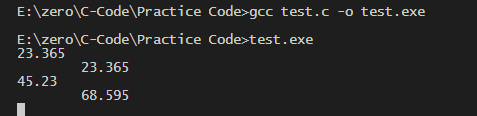
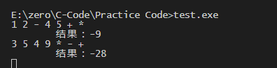
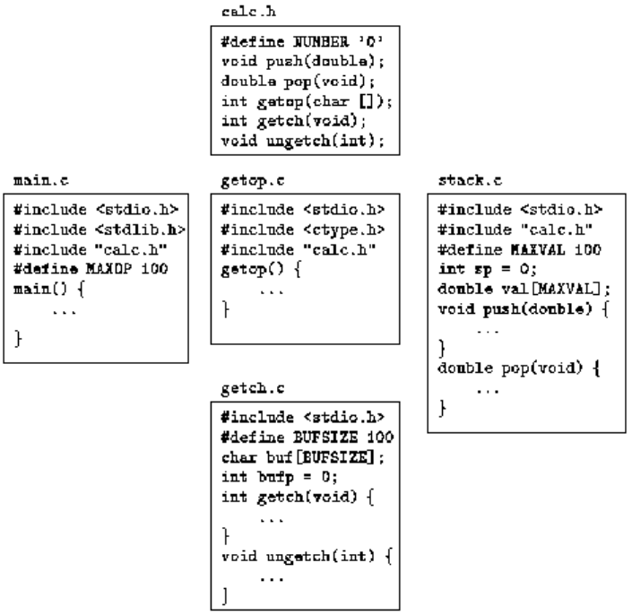

C 语言在设计中考虑了函数的高效性与易用性这两个因素。C 语言程序一般都由许多小的函数组成，而不是由少量较大的函数组成。一个程序可以保存在一个或者多个源文件中。各个文件可以单独编译，并可以与库中已编译过的函数一起加载。

目前 C 语言已经允许在声明函数时声明参数的类型。为了使函数的声明与定义相适应，ANSI 标准对函数定义的语法也做了修改。基于该原因，编译器就有可能检测出比以前的 C 语言版本更多的错误。并且，如果参数声明得当，程序可以自动地进行适当的强制类型转换。

ANSI 标准进一步明确了名字的作用域规则，特别要求每个外部对象只能有一个定义。初始化的适用范围也更加广泛了，自动数组与结构都可以进行初始化。

C 语言预处理的功能也得到了增强。新的预处理器包含一组更完整的条件编译指令（一种通过宏参数创建带引号的字符串的方法），对宏扩展过程的控制更严格。

## 一、函数的基本知识
示例：下面的程序将输入中包含特定“模式”或字符串的各行打印出来（这是 UNIX 程序 grep 的特例）例如，在下列一组文本行中查找包含字符串“ould”的行：
```
Ah Love! could you and I with Fate conspire To grasp this sorry Scheme of Things entire, Would not we shatter it to bits -- and then Re-mould it nearer to the Heart's Desire!
```

程序执行后输出下列结果：
```
Ah Love! could you and I with Fate conspire Would not we shatter it to bits -- and then Re-mould it nearer to the Heart's Desire!
```

该任务可以明确地划分成下列 3 部分：
```
while(还有未处理的行)
    if (该行包含指定的模式)
        打印该行
```
比较好的做法是利用其结构把每一部分设计成一个独立的函数。分别处理 3 个小的部分比处理一个大的整体更容易，因为这样可以把不相关的细节隐藏在函数中，从而减少了不必要的相互影响的机会，并且，这些函数也可以在其它程序中使用。

编写函数 strindex(s, t)实现“该行包含指定的模式”这个目标，下面是完整的程序
```
#include <stdio.h>
#define MAXLINE 1000 /* maximum input line length */

int getline(char line[], int max)
int strindex(char source[], char searchfor[]);

char pattern[] = "ould"; /* pattern to search for */

/* find all lines matching pattern */
void main(){
    char line[MAXLINE];
    int found = 0;

    while (getline(line, MAXLINE) > 0)
        if (strindex(line, pattern) >= 0) {
            printf("%s", line);
            found++;
        }
    return found;
}

/* getline: get line into s, return length */
int getline(char s[], int lim){
    int c, i;

    i = 0;
    while (--lim > 0 && (c=getchar()) != EOF && c != '\n')
        s[i++] = c;
    if (c == '\n')
        s[i++] = c;
    s[i] = '\0';
    return i;
}

/* strindex: return index of t in s, -1 if none */
int strindex(char s[], char t[]){
    int i, j, k;
    for (i = 0; s[i] != '\0'; i++) {
        for (j=i, k=0; t[k]!='\0' && s[j]==t[k]; j++, k++)
            ;
        if (k > 0 && t[k] == '\0')
            return i;
    }
    return -1;
}
```
函数的定义形式如下：
```
返回值类型 函数名(参数声明表){
    声明和语句
}
```
函数定义中的各构成部分都可以省略。最简单的函数如下所示：
```
dummy() {}
```
该函数不执行任何操作也不返回任何值。这种不执行任何操作的函数有时很有用，它可以在程序开发期间用以保留位置（留待以后填充代码）。如果函数定义中省略了返回值类型，则默认为 int 类型。

程序可以看成是变量定义和函数定义的集合。函数之间的通信可以通过参数、函数返回值以及外部变量进行。函数在源文件中出现的次序可以是任意的。只要保证每一个函数不被分离到多个文件中，源程序就可以分成多个文件。

被调用函数通过 return 语句向调用者返回值，return 语句的后面可以跟任何表达式：
```
return 表达式；
```
在必要时，表达式将被转换为函数的返回值类型。表达式两边通常加一对圆括号，此处的括号是可选的。

调用函数可以忽略返回值。return 语句的后面也不一定需要表达式。当 return语句的后面没有表达式时，函数将不向调用者返回值。当被调用函数执行到最后的右花括号而结束执行时，控制同样也会返回给调用者（不返回值）。

如果某个函数从一个地方返回时有返回值，而从另一个地方返回时没有返回值，该函数并不非法，但可能是一种出问题的征兆。在任何情况下，如果函数没有成功地返回一个值，则它的“值”肯定是无用的。

在上面的模式查找程序中，主程序 main 返回了一个状态，即匹配的数目。该返回值可以在调用该程序的环境中使用。

在不同的系统中，保存在多个源义件中的 C 语言程序的编译与加载机制是不同的。

例如，在 UNIX 系统中，假定有 3 个函数分别存放在名为 main.c、getline.c 与 strindex.c 的 3 个文件中，则可以使用命令
```
cc main.c getline.c strindex.c
```

来编译这 3 个文件，并把生成的目标代码分别存放在文件 main.o、getline.o 与 strindex.o 中，然后再把这 3 个文件一起加载到可执行文件 a.out 中。如果源程序中存在错误（比如文件 main.c 中存在错误），则可以通过命令
```
cc main.c getline.o strindex.o
```
对 main.c 文件重新编译，并将编译的结果与以前已编译过的目标文件 getline.o 和 strindex.o 一起加载到可执行文件中。cc 命令使用“.c”与“.o”这两种扩展名来区分源文件与目标文件。

#### 练习
- 编写函数 strindex(s, t)，它返回字符串 t 在 s 中最右边出现的位置。如果 s 中不包含 t，则返回-1。


## 二、返回非整型值的函数
示例，下面的函数会返回一个 double 类型的参数。该函数把字符串 s 转换为相应的双精度浮点数。该函数需要处理可选的符号和小数点，并要考虑可能缺少整数部分或小数部分的情况。
```
#include <ctype.h>
double atof(char s[]){
    double val, power;
    int i, sign;
    for (i = 0; isspace(s[i]); i++) /* skip white space */
        ;
    if (s[i] == '+' || s[i] == '-')
        ;
    for (val = 0.0; isdigit(s[i]); i++)
        val = 10.0 * val + (s[i] - '0');
    if (s[i] == '.')
        i++;
    for (power = 1.0; isdigit(s[i]); i++) {
        val = 10.0 * val + (s[i] - '0');
        power *= 10;
    }
    return val / power;
}
```
下面的函数中显式的调用了 atof 函数。
```
int getline(char s[],int lim){
    int c, i;

    for (i=0; i < lim-1 && (c=getchar())!=EOF && c!='\n'; ++i)
        s[i] = c;
    if (c == '\n') {
        s[i] = c;
        ++i;
    }
    //把字符'\0'（即空字符，其值为 0）插入数组的末尾，以标记字符串的结束。
    s[i] = '\0';
    return i;
}


/* rudimentary calculator */
int main(){
    double sum, atof(char []);
    char line[MAXLINE];

    sum = 0;
    while (getline(line, MAXLINE) > 0)
        printf("\t%g\n", sum += atof(line));
    return 0;
}
```
运行结果




其中，声明语句
```
double sum, atof(char []);
```
表明 sum 是一个 double 类型的变量，atof 函数带有个 `char[]` 类型的参数，且返回一个 double 类型的值。

函数 atof 的声明与定义必须一致。如果 atof 函数与调用它的主函数 main 放在同一源文件中，并且类型不一致，编译器就会检测到该错误。但是，如果 atof 函数是单独编译的（这种可能性更大），这种不匹配的错误就无法检测出来，atof 函数将返回 double 类型的值，而 main 函数却将返回值按照 int 类型处理，最后的结果值毫无意义。

如果没有函数原型，函数将在第一次出现的表达式中被隐式声明，例如：
```
sum += atof(line)
```

如果先前没有声明过的一个名字出现在某个表达式中，并且其后紧跟一个左圆括号，那么上下文就会认为该名字是一个函数名字，该函数的返回值将被假定为 int 类型，但上下文并不对其参数作任何假设。并且，如果函数声明中不包含参数，例如：
```
double atof（）；
```
那么编译程序也不会对函数 atof 的参数作任何假设，并会关闭所有的参数检查。对空参数表的这种特殊处理是为了使新的编译器能编译比较老的 C 语言程序。不过最好还是在函数声明中声明参数类型。如果无参，则用 void 声明。

#### 练习
- 对 atof 函数进行扩充，使它可以处理形如 123.45e-6 的科学表示法，其中，浮点数后面可能会紧跟一个 e 或 E 以及一个指数（可能有正负号）。

## 三、外部变量
C 语言程序可以看成由一系列的外部对象构成，这些外部对象可能是变量或函数。形容词 external 与 internal 相对的，internal 用于描述定义在函数内部的函数参数及变量。外部变量定义在函数之外，因此可以在许多函数中使用。

C 语言不允许在一个函数中定义其它函数，因此函数本身是“外部的”。默认情况下，外部变量与函数具有下列性质：通过同一个名字对外部变量的所有引用（即使这种引用来自于单独编译的不同函数）实际上都是引用同一个对象（标准中把这一性质称为外部链接）。

因为外部变量可以在全局范围内访问，这就为函数之间的数据交换提供了一种可以代替函数参数与返回值的方式。任何函数都可以通过名字访问一个外部变量，当然这个名字需要通过某种方式进行声明。

如果函数之间需要其享大量的变量，使用外部变量要比使用一个很长的参数表更方便、有效。但是这样做必须非常谨慎，因为这种方式可能对程序结构产生不良的影响，而且可能会导致程序中各个函数之间具有太多的数据联系。

外部变量的用途还表现在它们与内部变量相比具有更大的作用域和更长的生存期。自动变量只能在函数内部使用，从其所在的函数被调用时变量开始存在，在函数退出时变量也将消失。而外部变量是永久存在的，它们的值在一次函数调用到下一次函数调用之间保持不变。因此，如果两个函数必须共享某些数据，而这两个函数互不调用对方，这种情况下最方便的方式便是把这些共享数据定义为外部变量，而不是作为函数参数传递。

示例：编写一个具有加（+）、减（-）、乘（\*）、除（/）四则运算功能的计算器程序。程序中使用逆波兰表示法代替普通的中辍表示法。在逆波兰表示法中，所有运算符都跟在操作数的后面。例如
```
(1 – 2) * (4 + 5)
```
采用逆波兰表示法表示为：
```
1 2 - 4 5 + *
```
逆波兰表示法中不需要圆括号，只要知道每个运算符需要几个操作数就不会引起歧义。

程序的简要流程如下：
```
while (下一个运算符或操作数不是文件结束指示符)
    if (是数)
        将该数压入到栈中
    else if (是运算符)
        弹出所需数目的操作数
        执行运算
        将结果压入到栈中
    else if (是换行符)
        弹出并打印栈顶的值
    else
        出错
```

最好将栈的压入和弹出写成一个独立的函数，避免代码的重复。另外还需要一个单独的函数来取下一个输入运算符或操作数。

可以把栈及相关信息放在外部变量中，并只供 push 与 pop 函数访问，而不能被 main 函数访问。代码如下：
```c
#include <stdio.h>
#include <stdlib.h> /* for atof() */

#define MAXOP 100 /* max size of operand or operator */
#define NUMBER '0' /* signal that a number was found */

int getop(char []);
void push(double);
double pop(void);

/* reverse Polish calculator */
int main(){
    int type;
    double op2;
    char s[MAXOP];

    while ((type = getop(s)) != EOF) {
        switch (type) {
            case NUMBER:
                push(atof(s));
                break;
            case '+':
                push(pop() + pop());
                break;
            case '*':
                push(pop() * pop());
                break;
            case '-':
                op2 = pop();
                push(pop() - op2);
                break;
            case '/':
                op2 = pop();
                if (op2 != 0.0)
                    push(pop() / op2);
                else
                    printf("error: zero divisor\n");
                break;
            case '\n':
                printf("\t%.8g\n", pop());
                break;
            default:
                printf("error: unknown command %s\n", s);
                break;
        }
    }
    return 0;
}
```
‘/’ 和 ‘-’ 对操作数的顺序有要求，因此需要一个临时变量来保存前一个弹出的值
```
#define MAXVAL 100 /* maximum depth of val stack */
int sp = 0; /* next free stack position */
double val[MAXVAL]; /* value stack */

/* push: push f onto value stack */
void push(double f){
    if (sp < MAXVAL)
        val[sp++] = f;
    else
        printf("error: stack full, can't push %g\n", f);
}

double pop(void){
    if (sp > 0)
        return val[--sp];
    else {
        printf("error: stack empty\n");
        return 0.0;
    }
}
```
上面的程序中将 push 和 pop 函数必须共享的栈和栈顶指针定义在这两个函数的外部。但是，main 函数本身并没有引用栈或栈顶指针，因此，对 main 函数而言要将它们隐藏起来。

下面是 getop 函数的实现，该函数获取下一个运算符或操作数。
```c
#include <ctype.h>
int getch(void);
void ungetch(int);

/* getop: get next character or numeric operand */
int getop(char s[]){
    int i, c;
    while ((s[0] = c = getch()) == ' ' || c == '\t')
        ;
    s[1] = '\0';
    if (!isdigit(c) && c != '.')
        return c; /* not a number */
    i = 0;
    if (isdigit(c)) /* collect integer part */
        while (isdigit(s[++i] = c = getch()))
            ;
    if (c == '.') /* collect fraction part */
        while (isdigit(s[++i] = c = getch()))
            ;
    s[i] = '\0';
    if (c != EOF)
        ungetch(c);
    return NUMBER;
}
```
程序中经常会出现这样的情况：程序不能确定它已经读入的输入是否足够，除非超前多读入一些输入。读入一些字符以合成一个数字的情况便是一例：在看到第一个非数字字符之前，已经读入的数的完整性是不能确定的。由于程序要超前读入一个字符，这样就导致最后有一个字符不属于当前所要读入的数。

如果能“反读”不需要的字符，该问题就可以得到解决。每当程序多读入一个字符时，就把它压回到输入中，对代码其余部分而言就好像没有读入该字符一样。我们可以编写一对互相协作的函数来比较方便地模拟反取字符操作。getch 函数用于读入下一个待处理的字符，而 ungetch 函数则用于把字符放回到输入中，这样，此后在调用 getch 函数时，在读入新的输入之前先返回 ungetch 函数放回的那个字符。

这两个函数之间的协同工作也很简单。ungetch 函数把要压回的字符放到一个共享缓冲区（字符数组）中，当该缓冲区不空时，getch 函数就从缓冲区中读取字符；当缓冲区为空时，getch 函数调用 getchar 函数直接从输入中读字符。这里还需要增加一个下标变量来记住缓冲区中当前字符的位置。

由于缓冲区与下标变量是供 getch 与 ungetch 函数共享的，且在两次调用之间必须保持值不变，因此它们必须是这两个函数的外部变量。可以按照下列方式编写 getch、ungetch 函数及其共享变量：
```c
#define BUFSIZE 100
char buf[BUFSIZE]; /* buffer for ungetch */
int bufp = 0; /* next free position in buf */

int getch(void) { /* get a (possibly pushed-back) character */
    return (bufp > 0) ? buf[--bufp] : getchar();
}

void ungetch(int c){/* push character back on input */
    if (bufp >= BUFSIZE)
        printf("ungetch: too many characters\n");
    else
        buf[bufp++] = c;
}
```
标准库中提供了 ungetc，它将一个字符压回到栈中。

上面的代码放到一个源文件中，运行之后的结果如下：


> 不太理解为什么要使用 getch 代替 getchar()，我试了一下把 getch 换成 getchar，将 getop 函数中
```
if (c != EOF)
    ungetch(c);
```
两行注释掉，运行结果也还是一样的。如下：<br>



#### 练习
- 在有了基本框架后，对计算器程序进行扩充就比较简单了。在该程序中加入取模（%）运算符，并注意考虑负数的情况。

- 在栈操作中添加几个命令，分别用于在不弹出元素的情况下打印栈顶元素；复制栈顶元素；交换栈顶两个元素的值。另外增加一个命令用于清空栈。

- 给计算器程序增加访问 sin、exp 与 pow 等库函数的操作。

- 给计算器程序增加处理变量的命令（提供 26 个具有单个英文字母变量名的变量很容易）。增加一个变量存放最近打印的值。

- 编写一个函数 ungets(s)，将整个字符串 s 压回到输入中。ungets 函数需要使用 buf 和 bufp 吗？它能否仅使用 ungetch 函数？

- 假定最多只压回一个字符。请相应地修改 getch 与 ungetch 这两个函数。

- 以上介绍的 getch 与 ungetch 函数不能正确地处理压回的 EOF。考虑压回EOF 时应该如何处理？请实现你的设计方案。

- 另一种方法是通过 getline 函数读入整个输入行，这种情况下可以不使用 getch 与 ungetch 函数。请运用这一方法修改计算器程序。

## 四、作用域规则
构成 C 语言程序的函数与外部变量可以分开进行编译。一个程序可以存放在几个文件中，原先已编译过的函数可以从库中进行加载。

名字的作用域指的是程序中可以使用该名字的部分。对于在函数开头声明的自动变量来说，其作用域是声明该变量名的函数。不同函数中声明的具有相同名字的各个局部变量之间没有任何关系。函数的参数也是这样的，实际上可以将它看作是局部变量。

外部变量或函数的作用域从声明它的地方开始，到其所在的（待编译的）文件的末尾结束。例如，如果 main、sp、val、push 与 pop 是依次定义在某个文件中的 5 个函数或外部变量，如下所示：
```
main() { ... }

int sp = 0;
double val[MAXVAL];

void push(double f) { ... }
double pop(void) { ... }
```
在 push 与 pop 这两个函数中不需进行任何声明就可以通过名字访问变量 sp 与 val，但是，这两个变量名不能用在 main 函数中，push 与 pop 函数也不能用在 main 函数中。

另一方面，如果要在外部变量的定义之前使用该变量，或者外部变量的定义与变量的使用不在同一个源文件中，则必须在相应的变量声明中强制性地使用关键字 extern 。

将外部变量的声明与定义严格区分开来很重要。变量声明用于说明变量的属性（主要是变量的类型），而变量定义除此以外还将引起存储器的分配。

在一个源程序的所有源文件中，一个外部变量只能在某个文件中定义一次，而其它文件可以通过 extern 声明来访问它（定义外部变量的源文件中也可以包含对该外部变量的 extern 声明）。外部变量的定义中必须指定数组的长度，但 extern 声明则不一定要指定数组的长度。外部变量的初始化只能出现在其定义中。

假定函数 push 与 pop 定义在一个文件中，而变量 val 与 sp 在另一个文件中定义并被初始化（通常不大可能这样组织程序），则需要通过下面这些定义与声明把这些函数和变量“绑定”在一起：

在文件 file1 中：
```
extern int sp;
extern double val[];

void push(double f) { ... }
double pop(void) { ... }
```

在文件 file2 中：
```
int sp = 0;
double val[MAXVAL];
```

由于文件 file1 中的 extern 声明不仅放在函数定义的外面，而且还放在它们的前面，因此它们适用于该文件中的所有函数。对于 file1，这样一组声明就够了。如果要在同一个文件中先使用、后定义变量 sp 与 val，也需要按照这种方式来组织文件。

## 五、头文件
如果该程序的各组成部分很长，可以考虑把上述的计算器程序分割到若干个源文件中。我们这样分割：将主函数 main 单独放在文件 main.c 中；将 push 与 pop 函数以及它们使用的外部变量放在第二个文件 stack.c 中；将 getop 函数放在第三个文件 getop.c 中；将 getch 与 ungetch 函数放在第四个文件 getch.c 中。之所以分割成多个文件，主要是考虑在实际的程序中，它们分别来自于单独编译的库。

此外，还必须考虑定义和声明在这些文件之间的共享问题。我们尽可能把共享的部分集中在一起，这样就只需要一个副本，改进程序时也容易保证程序的正确性。我们把这些公共部分放在头文件 calc.h 中，在需要使用该头文件时通过#include 指令将它包含进来，这样分割后，程序的形式如下所示：



一方面是我们期望每个文件只能访问它完成任务所需的信息；另一方面是现实中维护较多的头文件比较困难。因此对于某些中等规模的程序，最好只用一个头文件存放程序中各部分共享的对象。较大的程序需要使用更多的头文件，我们需要精心地组织它们。


## 六、静态变量
用 static声明限定外部变量与函数，可以将其后声明的对象的作用域限定为被编译源文件的剩余部分。通过 static 限定外部对象，可以达到隐藏外部对象的目的

要将对象指定为静态存储，可以在正常的对象声明之前加上关键字 static 作为前缀。如果把上述两个函数和两个变量放在一个文件中编译，如下所示：
```
static char buf[BUFSIZE]; /* buffer for ungetch */
static int bufp = 0; /* next free position in buf */

int getch(void) { ... }
void ungetch(int c) { ... }
```

那么其它函数就不能访问变量 buf 与 bufp，因此这两个名字不会和同一程序中的其它文件中的相同的名字相冲突。同样，可以通过把变量 sp 与 val 声明为静态类型隐藏这两个用于执行栈操作使用的变量。

外部的 static 声明通常多用于变量，当然，它也可用于声明函数。通常情况下，函数名字是全局可访问的，对整个程序的各个部分而言都可见。但是，如果把函数声明为 static 类型，则该函数名除了对该函数声明所在的文件可见外，其它文件都无法访问。

static 也可用于声明内部变量。static 类型的内部变量是一种只能在某个特定函数中使用但一直占据存储空间的变量。

#### 练习
- 修改 getop 函数，使其不必使用 ungetch 函数。提示：可以使用一个 static 类型的内部变量解决该问题。


## 七、寄存器变量
register 声明告诉编译器，它所声明的变量在程序中使用频率较高。其思想是，将register 变量放在机器的寄存器中，这样可以使程序更小、执行速度更快。但编译器可以忽略此选项。

register 声明的形式如下所示：
```
register int x;
register char c;
```

register 声明只适用于自动变量以及函数的形式参数。下面是后一种情况的例子：
```c
f(register unsigned m, register long n){
    register int i;
    ...
}
```

实际使用时，底层硬件环境的实际情况对寄存器变量的使用会有一些限制。每个函数中只有很少的变量可以保存在寄存器中，且只允许某些类型的变量。编译器可以忽略过量的或不支持的寄存器变量声明。无论寄存器变量实际上是不是存放在寄存器中，它的地址都是不能访问的。在不同的机器中，对寄存器变量的数目和类型的具体限制也是不同的。

## 八、程序块结构
C 语言不允许在函数中定义定义函数。在函数中可以以程序块结构的形式定义变量。变量的声明（包括初始化）除了可以紧跟在函数开始的花括号之后，还可以紧跟在任何其它标识复合语句开始的左花括号之后。

```c

if (n > 0) {
    
    int i; /* declare a new i */
    
    for (i = 0; i < n; i++)
        ...
}
```

变量 i 的作用域是 if 语句的“真”分支，这个 i 与该程序块外声明的 i 无关。每次进入程序块时，在程序块内声明以及初始的自动变量都将被初始化。静态变量只在第一次进入程序块时被初始化一次。

自动变量（包括形式参数）也可以隐藏同名的外部变量与函数。在下面的声明中：
```c
int x;
int y;

f(double x){
    double y;
}
```
在一个好的程序设计风格中，应该避免出现变量名隐藏外部作用域中相同名字的情况，否则，很可能引起混乱和错误。

## 九、初始化
在不进行显式初始化的情况下，外部变量和静态变量都将被初始化为 0，而自动变量和寄存器变量的初值则没有定义（即初值为无用的信息）。

定义标量变量时，可以在变量名后紧跟一个等号和一个表达式来初始化变量：
``` c
int x = 1;
char squota = '\'';
long day = 1000L * 60L * 60L * 24L; /* milliseconds/day */
```

对于外部变量与静态变量来说，初始化表达式必须是常量表达式，且只初始化一次。对于自动变量与寄存器变量，则在每次进入函数或程序块时都将被初始化。

对于自动变量与寄存器变量来说，初始化表达式可以不是常量表达式：表达式中可以包含任意在此表达式之前已经定义的值，包括函数调用
```c
int binsearch(int x, int v[], int n){
    int low = 0;
    int high = n - 1;
    int mid;
    ...
}
```
可以用下面的形式代替
```c
int low, high, mid;

low = 0;
high = n - 1;
```
一般使用显式的赋值语句。

数组的初始化可以在声明的后面紧跟一个初始化表达式列表，初始化表达式列表用花括号括起来，各初始化表达式之间通过逗号分隔。例如
```c
int days[] = {31, 28, 31, 30, 31, 30, 31, 31, 30, 31, 30, 31};
```
当省略数组的长度时，编译器将把花括号中初始化表达式的个数作为数组的长度，上面代码中程序的长度为 12。

数组中没有被初始化的元素会用 0 填充，元素的数量不能超过数组的长度，否则会报错，并且数组的初始化是按顺序的（0 1 2 ..）。

可以直接以字符串的形式为字符数组赋值，如下：
```
char pattern[] = "ould ";
```
也可以用多个用逗号分隔的字符的形式赋值，如下
```
char pattern[] = { 'o', 'u', 'l', 'd'};
```
上面字符数组的长度为 5，最后一个是‘\0’（系统默认）。

## 十、递归
递归调用是指函数直接或者间接调用其本身。

示例：
```c
#include <stdio.h>

/* printd: print n in decimal */
void printd(int n){
    if (n < 0) {
        putchar('-');
        n = -n;
    }
    if (n / 10)
        printd(n / 10);
    
    putchar(n % 10 + '0')
}
```
函数递归调用自身时，每次调用都会得到一个与以前的自动变量集合不同的新的自动变量集合。

一个能较好说明递归的例子是快速排序。快速排序算法是 C. A. R. Hoare 于 1962 年发明的。对于一个给定的数组，从中选择一个元素，以该元素为界将其余元素划分为两个子集，一个子集中的所有元素都小于该元素，另一个子集中的所有元素都大于或等于该元素。对这样两个子集递归执行这一过程，当某个子集中的元素数小于 2 时，这个子集就不需要再次排序，终止递归。代码如下：
```c
/* qsort: sort v[left]...v[right] into increasing order */ 
void qsort(int v[], int left, int right){
    int i, last;
    void swap(int v[], int i, int j);

    if (left >= right)
        return;
    swap(v, left, (left + right)/2);
    last = left;
    for (i = left + 1; i <= right; i++)
        if (v[i] < v[left])
            swap(v, ++last, i);
    swap(v, left, last);
    qsort(v, left, last-1);
    qsort(v, last+1, right);
}

void swap(int v[], int i, int j){
    int temp;

    temp = v[i];
    v[i] = v[j];
    v[j] = temp;
}

void main(){
	int sort[] = {1 , 7, 9, 2, 0, 3};
	qsort(sort, 0, 5);

	for (int i = 0; i < 5; i++)
	{
		printf("%d ", sort[i]);
	}
	printf("\n");
	
}
```
运行结果如下
```
E:\zero\C-Code\Practice Code>gcc test.c -o test.exe

E:\zero\C-Code\Practice Code>test.exe
0 1 2 3 7

E:\zero\C-Code\Practice Code>
```

标准库中提供了一个 qsort 函数，它可用于对任何类型的对象排序。

递归调用过程中必须在某个地方维护一个存储处理值的栈，因此它并不会节省存储器开销。它的优点是使代码更加紧凑，更加易于编写。

#### 练习
- 运用 printd 函数的设计思想编写一个递归版本的 itoa 函数，即通过递归调用把整数转换为字符串。

- 编写一个递归版本的 reverse(s)函数，以将字符串 s 倒置。

## 十一、C 预处理器
从概念上讲，预处理器是编译过程中单独执行的第一个步骤。两个最常用的预处理器指令是：#include 指令（用于在编译期间把指定文件的内容包含进当前文件中）和#define 指令（用任意字符序列替代一个标记）。

#### 1. 文件包含
文件包含指令（即#include 指令）使得处理大量的#define 指令以及声明更加方便。如下：
```c
#include "文件名"
```
或
```c
#include <文件名>
```
的行都将被替换为由文件名指定的文件的内容。如果文件名用引号引起来，则在源文件所在位置查找该文件；如果在该位置没有找到文件，或者如果文件名是用尖括号<与>括起来的，则将根据相应的规则查找该文件，这个规则同具体的实现有关。

源文件的开始处通常都会有多个#include 指令，它们用以包含常见的 #define 语句和 extern 声明，或从头文件中访问库函数的函数原型声明。

在大的程序中，#include 指令是将所有声明捆绑在一起的较好的方法。它保证所有的源文件都具有相同的定义与变量声明，这样可以避免出现一些不必要的错误。如果某个包含文件的内容发生了变化，那么所有依赖于该包含文件的源文件都必须重新编译。

#### 2. 宏替换
宏定义的形式如下：

```c
#define 名字 替换文本
```

这是一种最简单的宏替换——后续所有出现名字记号的地方都将被替换为替换文本。#define 指令中的名字与变量名的命名方式相同，替换文本可以是任意字符串。

可以把一个较长的宏定义分成若干行，这时需要在待续的行末尾加上一个反斜杠符\。#define 指令定义的名字的作用域从其定义点开始，到被编译的源文件的末尾处结束。

宏定义中也可以使用前面出现的宏定义。

替换文本可以是任意的，例如
```
#define forever for (;;) /* infinite loop */
```
该语句为无限循环定义了一个新名字 forever。

宏定义也可以带参数，这样可以对不同的宏调用使用不同的替换文本。例如，下列宏定义定义了一个宏 max：
```
#define max(A, B) ((A) > (B) ? (A) : (B))
```
宏调用直接将替换文本插入到代码中。形式参数（在此为 A 或 B）的每次出现都将被替换成对应的实际参数。因此，语句：
```
x = max(p+q, r+s);
```
将被替换为下列形式：
```
x = ((p+q) > (r+s) ? (p+q) : (r+s));
```

如果对各种类型的参数的处理是一致的，则可以将同一个宏定义应用于任何数据类型，而无需针对不同的数据类型需要定义不同的 max 函数。不过使用上面的宏定义会导致表达式计算两次，这种情况下如果使用自增或者自减运算符就会出问题

```
max(i++, j++) /* WRONG */
```

注意要适当使用圆括号以保证计算次序的正确性。

可以通过#undef 指令取消名字的宏定义，例如：
```
#undef getchar
int getchar(void) { ... }
```
形式参数不能用带引号的字符串替换。但是，如果在替换文本中，参数名以#作为前缀，则会将该参数名加上引号之后传入，例如：
```
#define dprint(expr) printf(#expr " = %g\n", expr)
dprint(x/y)
```
调用该宏时，该宏将被扩展为：
```
printf("x/y"" = &g\n", x/y); 
```
其中的字符串被连接起来了，中间的两个 "" 会被当做空字符串。这样，该宏调用的效果等价于
```
printf("x/y = &g\n", x/y);
```

预处理器运算符##为宏扩展提供了一种连接实际参数的手段。如果替换文本中的参数与##相邻，则该参数将被实际参数替换，##与前后的空白符将被删除，并对替换后的结果重新扫描。例如，下面定义的宏 paste 用于连接两个参数
```
#define paste(front, back) front ## back
```
因此，宏调用 paste(name, 1) 的结果将建立记号 name1。

##### 练习
定义宏 swap(t, x, y）以交换 t 类型的两个参数。

#### 3. 条件包含
还可以使用条件语句对预处理本身进行控制，这种条件语句的值是在预处理执行的过程中进行计算。这种方式为在编译过程中根据计算所得的条件值选择性地包含不同代码提供了一种手段。

#if 语句对其中的常量整型表达式（其中不能包含 sizeof、类型转换运算符或 enum 常量）进行求值，若该表达式的值不等于 0，则包含其后的各行，直到遇到#endif、#elif 或 #else 语句为止（预处理器语句 #elif 类似于 else if）。

在 #if 语句中可以使用表达式 defined (名字)，该表达式的值遵循下列规则：当名字已经定义时，其值为 1；否则，其值为 0。例如：
```
#if !defined(HDR) 
#define HDR 
/* hdr.h 文件的内容放在这里 */ 
#endif
```
上面的语句确保了 hdr.h 只被包含一次。类似的方式也可以用来避免多次重复包含同一文件。

C 语言专门定义了两个预处理语句 #ifdef 与 #ifndef，它们用来测试某个名字是否已经定义。上面的例子可以改写为下列形式：
```
#ifndef HDR  //这一句等价于 #if !defined(HDR)
#define HDR 
/* hdr.h 文件的内容放在这里 */ 
#endif
```


