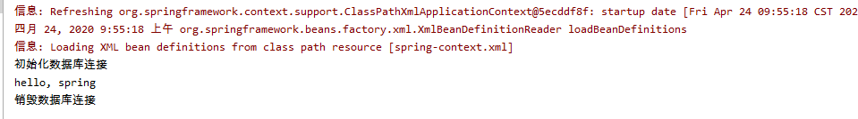

## 一、Spring

#### 1. Spring 简介
Spring 的主要作用就是为代码“解耦”，降低代码间的耦合度

根据功能的不同，可以将一个系统中的代码分为主业务逻辑和系统级业务逻辑（交叉业务逻辑）两类。它们各自具有鲜明的特点：主业务代码间逻辑联系紧密，有具体的专业业务应用场景，复用性相对较低；系统级业务相对功能独立，没有具体的专业业务应用场景，主要是为主业务提供系统级服务，如日志、安全、事物等，复用性强。

Spring 根据代码的功能特点，将降低耦合度的方式分为了两类：IoC 和 AOP。IoC 使得主业务在相互调用的过程中，不用再自己维护关系了，即不用再自己创建要使用的对象了。而是由 Spring 容器统一管理，自动“注入”。而 AOP 使得系统级服务得到了最大复用，且不用再由程序员手工将系统级服务“混杂”到主业务逻辑中了，而是由 Spring 容器统一完成“织入”

Spring 是于 2003 年兴起的一个轻量级 Java 开发框架，它是为了解决企业应用开发的复杂性而创建的。Spring 的核心是控制反转（IoC）和面向切面编程（AOP）。简单来说，Spring 是一个分层的 Java SE/EE full-stack（一站式）轻量级开源框架

#### 2. Spring 体系结构


Spring 由 20 多个模块组成，它们可以分为数据访问/集成（Data Access/Integration）、Web、面向切面编程（AOP，Aspects）、应用服务器设备管理（Instrumentation）、消息发送（Messsaging）、核心容器（Core Container）和测试（Test）

JDBC 是 java 的连接标准，而不是实现。

#### 3. Spring 特点
##### （1）非侵入式
Spring 框架的 API 不会再业务逻辑上出现，即业务逻辑是 POJO。由于业务逻辑中没有 Spring 的 API，所以业务员逻辑可以从 Spring 框架快速的移植到其他框架，即与环境无关。

##### （2）容器
Spring 作为一个容器，可以管理对象的生命周期、对象与对象之间的依赖关系。可以通过配置文件，来定义对象，以及设置与其他对象的依赖关系。

##### （3）IoC
控制反转（Inversion of Control）,即创建被调用者的实例不是由调用者完成的，而是由 Spring 容器完成的，并注入调用者。

当应用了 IoC，一个对象依赖的其他对象会通过被动的方式传递进来，而不是这个对象自己创建或者查找依赖对象。即，不是对象从容器中查找依赖，而是容器在对象初始化时不等对象请求就主动将依赖传递给它。

##### （4）AOP
面向切面变成（AOP，Aspect Orient Programming），是一种编程思想，是面向对象 OOP 的补充。很多框架都实现了对 AOP 编程思想的实现。Spring 也提供了面向切面编程的丰富支持，允许通过分离应用的业务逻辑与系统级服务（例如日志和事务管理）进行开发。应用对象只实现它们应该做的——完成业务逻辑——仅此而已。它们并不负责其他的系统级关注点，例如日志或事务支持

#### 4. Spring 与 IoC
控制反转（IoC，Inversion of Control），是一个概念，是一种思想。指将传统上由程序代码直接操控的对象调用权交给容器，通过容器来是现对象的装配与管理。控制反转就是对对象控制权的转移，从程序代码本身反转到了外部容器。

IoC 是一个概念，是一种思想，其实现方式多种多样。当前比较流行的实现方式有两种：依赖注入和依赖查找。依赖注入方式应用更为广泛。
- 依赖查找：Dependency Lookup，DL，容器提供回调接口和上下文环境给组件，程序代码则需要提供具体的查找方式。
- 依赖注入：Dependency Injection，DI，程序代码不做定位查询，这些工作由容器自行完成。

依赖注入对调用者与被调用者几乎没有任何要求，完全支持 POJO 之间依赖管理。

依赖注入是目前最优秀的解耦方式。依赖注入让 Spring 的 Bean 之间以配置文件的方式组织在一起，而不是以硬编码的方式耦合在一起。

#### 5. 第一个 Spring 应用程序
- **创建 pom.xml**

创建一个工程名为 hello-spring 的项目，pom.xml 文件如下
```xml
<project xmlns="http://maven.apache.org/POM/4.0.0"
         xmlns:xsi="http://www.w3.org/2001/XMLSchema-instance"
         xsi:schemaLocation="http://maven.apache.org/POM/4.0.0 http://maven.apache.org/xsd/maven-4.0.0.xsd">
    <modelVersion>4.0.0</modelVersion>

    <groupId>com.zero</groupId>
    <artifactId>hello-spring</artifactId>
    <version>1.0.0-SNAPSHOT</version>
    <packaging>war</packaging>

    <dependencies>
        <dependency>
            <groupId>org.springframework</groupId>
            <artifactId>spring-context</artifactId>
            <version>4.3.17.RELEASE</version>
        </dependency>
    </dependencies>
</project>
```

在 Maven 的仓库上看到的 Spring 的最新版本是 `5.2.5.RELEASE` ，根据版本号规则，Spring 4 和 Spring 5 在架构上有所不同，现在开发单体应用的话用 Spring 4，一般企业级应用开发用的都是 Spring 5，而且单体应用正在被淘汰。

在 IntelliJ 的 Maven Project 面板中，有一个选项用于查看当前项目的依赖树，会以图片的形式展示出来，如下图：


不过当依赖的库比较多时，打开这个可能会导致电脑死机。

- **完善代码目录**

代码目录结构如下图：


- **UserService 和 UserServiceImpl**

```java
package com.zero.hello.spring.services;

public interface UserService {
    void sayHi();
}

```

这里使用到了接口隔离原则。但是接口隔离原则具体是什么我还不太清楚。

```java
package com.zero.hello.spring.services.impl;

import com.zero.hello.spring.services.UserService;

public class UserServiceImpl implements UserService {
    public void sayHi() {
        System.out.println("hello, spring");
    }
}
```

用于测试，直接在控制台打印输出

- **spring-context.xml**

```xml
<?xml version="1.0" encoding="UTF-8"?>
<beans xmlns="http://www.springframework.org/schema/beans"
       xmlns:xsi="http://www.w3.org/2001/XMLSchema-instance"
       xsi:schemaLocation="http://www.springframework.org/schema/beans
    http://www.springframework.org/schema/beans/spring-beans-3.0.xsd">

    <bean id="userService" class="com.zero.hello.spring.services.impl.UserServiceImpl"/>

</beans>
```

- **创建测试类**

```java
package com.zero.hello.spring;

import com.zero.hello.spring.services.UserService;
import org.springframework.context.ApplicationContext;
import org.springframework.context.support.ClassPathXmlApplicationContext;

public class MyTest {

    public static void main(String[] args) {
        ApplicationContext applicationContext = new ClassPathXmlApplicationContext("spring-context.xml");
        UserService userService = (UserService) applicationContext.getBean("userService");

        userService.sayHi();
    }
}
```

上面的代码首先创建了一个上下文，同时将创建的 spring-context 加载进来了。Spring 能够通过 id 创建要实例化的对象，是应为我们创建了配置文件，但是也因为是我们创建的，因此 Spring 需要知道配置文件叫什么名字，在什么地方，这就需要我们告诉 Spring 的。

> 不过为什么不能固定文件的名字和路径呢？

- **测试运行**


## 二、什么是 TDD 及常用的测试方法
#### 1. JUnit 简介
JUnit是用于编写和运行可重复的自动化测试的开源测试框架， 这样可以保证我们的代码按预期工作。JUnit可广泛用于工业和作为支架(从命令行)或IDE(如Eclipse)内单独的Java程序。

JUnit提供：
- 断言测试预期结果。
- 测试功能共享通用的测试数据。
- 测试套件轻松地组织和运行测试。
- 图形和文本测试运行。

JUnit用于测试：
- 整个对象
- 对象的一部分 - 交互的方法或一些方法
- 几个对象之间的互动(交互)

#### 2. JUnit的特点
- JUnit是用于编写和运行测试的开源框架。
- 提供了注释，以确定测试方法。
- 提供断言测试预期结果。
- 提供了测试运行的运行测试。
- JUnit测试让您可以更快地编写代码，提高质量
- JUnit是优雅简洁。它是不那么复杂以及不需要花费太多的时间。
- JUnit测试可以自动运行，检查自己的结果，并提供即时反馈。没有必要通过测试结果报告来手动梳理。
- JUnit测试可以组织成测试套件包含测试案例，甚至其他测试套件。
- Junit显示测试进度的，如果测试是没有问题条形是绿色的，测试失败则会变成红色。

#### 3. 其他测试方法
测试也是一套完整的学科

- TDD：测试驱动编程。先写测试在编码。这种开发模式可以保证代码质量，测试的覆盖率高，但是开发效率低下。

- DDD：领域驱动测试。

- 白盒测试：能看到完整代码的

- 黑盒测试：没有源码的，功能测试。

- 灰盒测试

- 压力测试：并发数的问题，能承载多少并发

- 疲劳强度测试：是否能够长期稳定的运行，标准是能够运行72小时

- 冒烟测试：一个功能点，疯狂的测试。对主要流程测试

- 集成测试：完整功能的测试。测试整体业务流程。

- 回归测试：增加一个功能，再次整体业务，防止增加的功能影响项目的运行

- 自动化测试：编码、场景设计

- review：代码评审。

## 三、第一个JUnit单元测试
#### 1. 完善测试目录
在 test 目录下创建名为 java 的文件夹，用作测试目录，接着在这个文件夹下创建包 `con.zero.hello.spring.services.test`，注意测试中的包不能与业务代码中的包重名。


一般要测试哪一个包下的类，就相应为这个包创建一个测试包。


#### 2. pom.xml
在 pom.xml 中添加 JUnit 依赖包

```xml
<project xmlns="http://maven.apache.org/POM/4.0.0"
         xmlns:xsi="http://www.w3.org/2001/XMLSchema-instance"
         xsi:schemaLocation="http://maven.apache.org/POM/4.0.0 http://maven.apache.org/xsd/maven-4.0.0.xsd">
    <modelVersion>4.0.0</modelVersion>

    <groupId>com.zero</groupId>
    <artifactId>hello-spring</artifactId>
    <version>1.0.0-SNAPSHOT</version>
    <packaging>war</packaging>

        ...

        <!-- https://mvnrepository.com/artifact/junit/junit -->
        <dependency>
            <groupId>junit</groupId>
            <artifactId>junit</artifactId>
            <version>4.13</version>
            <scope>test</scope>
        </dependency>

    </dependencies>
</project>
```

#### 3. 创建测试类
```java
package com.zero.hello.spring.services.test;

import com.zero.hello.spring.services.UserService;
import org.junit.After;
import org.junit.Before;
import org.junit.Test;
import org.springframework.context.ApplicationContext;
import org.springframework.context.support.ClassPathXmlApplicationContext;

public class UserServiceTest {
    UserService userService;

    @Before
    public void before(){
        ApplicationContext context = new ClassPathXmlApplicationContext("spring-context.xml");
        userService = (UserService) context.getBean("userService");
        System.out.println("初始化数据库连接");
    }

    @Test
    public void test(){
        userService.sayHi();
    }

    @After
    public void after(){
        System.out.println("销毁数据库连接");
    }
}
```

#### 4. 运行
将光标移到要执行的测试方法，右击鼠标，点击 `Run test()`


运行结果如下



## 四、JUnit 常用注解
|注解|描述|
|--|--|
|`@Before`|使用了该注释的方法，会在每个测试用例运行之前运行|
|`@Test`|使用该注释指定一个测试用例|
|`@BeforClass`|该注释只能用于静态方法，在测试类所有测试用例之前运行，只会执行一次，可用于做全局共享配置|
|`@After`|使用了该注释的方法会在每一个测试用例运行之后运行|
|`@AfterClass`|在所有的测试用例运行之后运行，也是只能用于静态方法，且只会运行一次。|
|`@Ignore`|该注释可以使某一个测试用例暂时不生效|

## 五、JUnit 断言
> 断言是编程术语，表示为一些布尔表达式，程序员相信在程序中的某个特定点该表达式值为真，可以在任何时候启用和禁用断言验证，因此可以在测试时启用断言而在部署时禁用断言。同样，程序投入运行后，最终用户在遇到问题时可以重新启用断言。

> 使用断言可以创建更稳定、品质更好且 不易于出错的代码。当需要在一个值为FALSE时中断当前操作的话，可以使用断言。单元测试必须使用断言（Junit/JunitX）。

##### （1）常用的断言方法
|断言|描述|
|`void assertEquals([String message], expected value, actual value)`|断言两个值相等。值可能是类型有 int, short, long, byte, char or java.lang.Object. 第一个参数是一个可选的字符串消息|
|`void assertTrue([String message], boolean condition)`|断言一个条件为真|
|`void assertFalse([String message],boolean condition)`|断言一个条件为假|
|`void assertNotNull([String message], java.lang.Object object)`|断言一个对象不为空(null)|=
|`void assertNull([String message], java.lang.Object object)`|断言一个对象为空(null)|
|`void assertSame([String message], java.lang.Object expected, java.lang.Object actual)`|断言，两个对象引用相同的对象|
|`void assertNotSame([String message], java.lang.Object unexpected, java.lang.Object actual)`|断言，两个对象不是引用同一个对象|
|`void assertArrayEquals([String message], expectedArray, resultArray)`|断言预期数组和结果数组相等。数组的类型可能是 int, long, short, char, byte or java.lang.Object.|


##### （2）示例
```java
import org.junit.Test;
import static org.junit.Assert.*;

public class TestAssertions {

   @Test
   public void testAssertions() {
      //test data
      String str1 = new String ("abc");
      String str2 = new String ("abc");
      String str3 = null;
      String str4 = "abc";
      String str5 = "abc";
      int val1 = 5;
      int val2 = 6;
      String[] expectedArray = {"one", "two", "three"};
      String[] resultArray =  {"one", "two", "three"};

      //Check that two objects are equal
      assertEquals(str1, str2);

      //Check that a condition is true
      assertTrue (val1 < val2);

      //Check that a condition is false
      assertFalse(val1 > val2);

      //Check that an object isn't null
      assertNotNull(str1);

      //Check that an object is null
      assertNull(str3);

      //Check if two object references point to the same object
      assertSame(str4,str5);

      //Check if two object references not point to the same object
      assertNotSame(str1,str3);

      //Check whether two arrays are equal to each other.
      assertArrayEquals(expectedArray, resultArray);
   }
}
```

## 六、Log4j
#### 1. Log4j 简介
日执信息根据用途不同，分为调试日志，运行日志和异常日志等。

Log4j 全称为 Log for Java，它是一个基于Java的日志记录工具。

Log4j 主要由三部分组成：
- loggers：负责采集日志信息。
- appenders：负责将日志信息发布到不同地方。
- layouts：负责以各种风格格式化日志信息。

#### 2. Log4j 日志级别
日志级别由高到低，分为 6 个级别：
- fatal（致命的）：导致应用程序提前终止的严重错误。一般这些信息将立即呈现在状态控制台上。
- error：其他运行时错误或意外情况。一般这些信息将立即呈现在状态控制台上。
- warn：使用已过时的API，API的滥用，潜在错误，其他不良的或意外的运行时的状况（但不一定是错误的）。一般这些信息将立即呈现在状态控制台上。
- info：令人感兴趣的运行时事件（启动/关闭）。一般这些信息将立即呈现在状态控制台上，因而要保守使用，并保持到最低限度。
- debug：流经系统的详细信息。一般这些信息只记录到日志文件中。
- trace（堆栈）：最详细的信息。一般这些信息只记录到日志文件中。

在代码中可以指定哪个级别的信息输出，哪个级别的信息不输出，以保证日志信息不会对系统运行造成太大的影响的同时，对系统进行监控。

#### 3. 日志输出简介
Log4j 的日志输出控制文件主要由 3 个部分构成
- 日志信息的输出位置：指示日志信息是输出到控制台还是文件
- 日志信息的输出格式：指示日志信息以怎样的字符串形式显示
- 日志信息的输出级别：指定哪些级别的日志信息将会被输出

#### 4. 日志属性配置文件
日志属性文件 `log4j.properties` 是专门用于控制日志输出的，主要进行三方面的控制
- 输出位置
- 输出格式
- 输出级别

日志属性文件由两个对象组成：
- 日志附加器：它由日志输出文件定义，包含一些其他的属性
- 根日志：这是 Java 中的日志记录器，由两个属性构成
    - 日志输出级别
    - 日志附加器

#### 5. 日志附加器
它的作用是为日志记录器附加其他设置信息，它本质是一个接口，通过下面的语法定义
```
log4j.appender.appenderName = 输出位置
```

##### （1）常用的附加器实现类
- **`org.apache.log4j.ConsoleAppender`**：日志输出到控制台
- **`org.apache.log4j.FileAppender`**：日志输出到文件
- **`org.apache.log4j.RollingFileAppender`**：指定日志文件大小，当输出的信息达到上限的时候，创建一个新的同等大小的文件。
- **`org.apache.log4j.DailyRollingFileAppender`**：每天产生一个日志文件。

#### 6. 常用布局类型
- **`org.apache.log4j.HTMLLayout`**：网页布局，以 HTML 表格形式布局
- **`org.apache.log4j.SimpleLayout`**：简单布局,包含日志信息的级别和字符串
- **`org.apache.log4j.PatternLayout`**：匹配器布局，可以灵活的指定布局模式，主要是通过设置 PatternLayout 的 ConversionPattern 属性值来控制具体的输出格式

打印参数: Log4j 采用类似 C 语言中的 printf 函数的打印格式化日志信息
- `%m`：输出代码中指定的消息
- `%p`：输出优先级。`DEBUG`，`INFO`，`WARN`，`ERROR`，`FATAL`
- `%r`：输出自应用启动到输出该 log 信息耗费的毫秒数。
- `%c`：输出所属的类目，通常就是所在类的全名
- `%n`：输出一个回车换行符，Windows 平台为 `/r/n`，Unix 平台为 `/n`


## 报错
创建第一个 Spring 程序的时候，第一次配置 Maven 依赖的时候报错
```
*   Cannot resolve plugin org.apache.maven.plugins:maven-resources-plugin:2.6
*   Cannot resolve plugin org.apache.maven.plugins:maven-war-plugin:2.2
*   Cannot resolve plugin org.apache.maven.plugins:maven-surefire-plugin:2.12.4
*   Cannot resolve plugin org.apache.maven.plugins:maven-install-plugin:2.4
*   Cannot resolve plugin org.apache.maven.plugins:maven-deploy-plugin:2.7
*   Cannot resolve plugin org.apache.maven.plugins:maven-site-plugin:3.3
```

去搜索了一下解决方案

删除 maven 本地仓库下的 maven（org/apache/maven） 依赖包。
